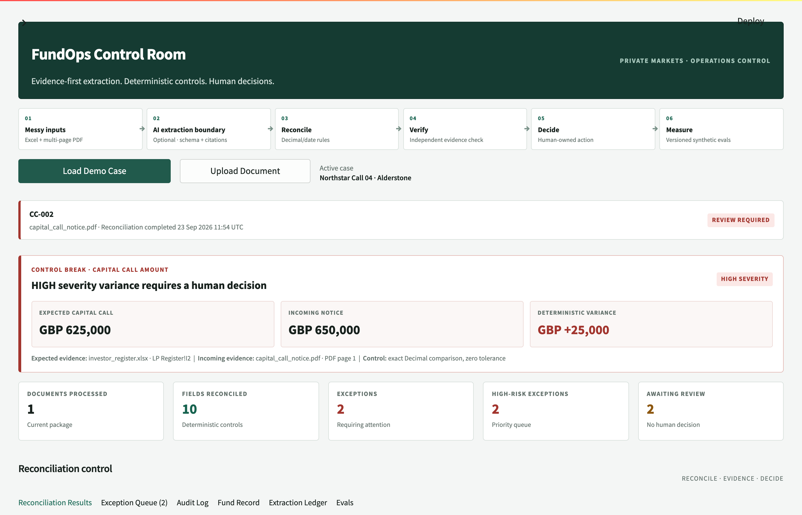

# FundOps Control Room (YLOOKUP)

Offline-first capital-call reconciliation for private-markets fund operations. It reads a capital-call notice (PDF or TXT), extracts typed fields with page-level evidence, checks them against the investor register with deterministic controls, runs an independent evidence review, and records the human decision in an append-only SQLite audit log. It is a single-process Streamlit app built as a hackathon project; every fund, investor and amount in the repository is fictional.



*The Streamlit app running locally with no API key, after clicking **Load Demo Case**. The Northstar fund, investor and amounts are synthetic.*

- **Grounding rule.** In the optional model mode, a model-returned field is kept only if its quoted evidence text appears on the page it cites (case-insensitive, whitespace-normalised match in `_ground_evidence`, [`app/extraction.py`](app/extraction.py)). Otherwise the field is discarded, the deterministic value is kept where one exists and a warning is shown.
- **Deterministic controls.** Amounts are compared as Python `Decimal` values with zero tolerance by default; dates, currency, references, missing values and a 0.80 confidence threshold are fixed rules ([`app/reconciliation.py`](app/reconciliation.py)). No model can clear a control break or make the decision.
- **Evaluation harness.** `python -m app.evals` runs the current extraction, reconciliation and reviewer code over 27 synthetic cases (270 labelled fields) with 4 count-based regression gates. Current fixture result: **267/270** fields extracted exactly, **12/12** gold exceptions found at 12/14 precision, **210/210** isolated rule outcomes correct, **4/4** gates pass.
- **No model calls in fixture mode.** The fixture evaluation uses the deterministic extractor and reviewer and reports 0 model calls, so these figures are regression results on synthetic data, not LLM or production accuracy.
- **Tests.** 150 pytest tests, runnable offline.

```bash
python3 -m venv .venv && source .venv/bin/activate
python -m pip install -r requirements.txt
python -m pytest -q                                        # 150 tests
python -m app.evals --mode fixture --fail-on-regression    # 27-case eval, exits 1 if a gate fails
streamlit run streamlit_app.py                             # then click "Load Demo Case"
```

No API key or network access is needed after the dependencies are installed.

## System architecture


*Purple: model call · blue: deterministic code · green: human · amber: evaluation · grey: storage · dashed: external, optional, mocked or planned*

An analyst loads the synthetic Northstar demo or uploads a text-based PDF/TXT notice; after bounded validation, the deterministic label parser extracts typed fields with page-level evidence. Reconciliation compares those fields with a checked-in canonical JSON fund record using `Decimal` and date rules (the XLSX register is shown and downloadable but not parsed live), and the evidence reviewer then checks each field's citation as a separate step. Rows that break a control or lack supporting evidence go to the exception queue, where a human decision and reason are appended to the SQLite audit log, while the eval harness replays the same extraction, reconciliation and review code over the synthetic gold corpus. Diagram source: [`docs/architecture.mmd`](docs/architecture.mmd).

The optional model boundary is limited to interpreting document text and independently reviewing cited evidence. Typed normalisation, financial comparisons, severities, exception states and audit writes remain deterministic. Module boundaries are documented in [docs/ARCHITECTURE.md](docs/ARCHITECTURE.md) and the canonical interfaces in [docs/AGENT_CONTRACTS.md](docs/AGENT_CONTRACTS.md). Design questions (why an LLM at all, hallucination handling, scaling, what is implemented versus mocked) are answered in [docs/TECHNICAL_FAQ.md](docs/TECHNICAL_FAQ.md).

## How AI is used

- **Off by default.** The offline demo and the fixture evaluation make no model calls. With `OPENAI_API_KEY` set, two sidebar checkboxes enable an OpenAI-compatible chat-completions model (`OPENAI_MODEL`, default `gpt-4.1-mini`, temperature 0, JSON output); see [Optional model mode](#optional-model-mode).
- **Extraction.** The model receives the notice's page text and proposes fields. A field is kept only if it parses to the field's type, has a confidence between 0 and 1 and quotes evidence found on the cited page; otherwise the deterministic value or an explicit abstention is kept and a warning is shown.
- **Evidence review.** The model receives one field's value, citation and reconciliation result and returns `SUPPORTED`, `CHALLENGE` or `INSUFFICIENT_EVIDENCE`. Local checks overrule a `SUPPORTED` verdict when the cited evidence negates the value, does not contain it or contains a competing value. A failed call becomes `NOT_REVIEWED` and the row stays in the human queue.
- **What stays deterministic or human.** The model has no tools and no write access. Normalisation, `Decimal` comparisons, severities, exception states and audit writes are code, and only a person records Approved, Rejected or Needs investigation.
- **Evaluation.** `--mode model` in the eval harness scores grounded model-origin fields separately from fallbacks, but no model-mode result is recorded; the published figures come from the deterministic path.

## Requirements

`requirements.txt` resolves on Python 3.9 to 3.13. Streamlit excludes 3.9.7, and the pinned `pandas<2.3` publishes no wheels for Python 3.14. [`.python-version`](.python-version) selects 3.12 for pyenv or uv.

## Demo flow

1. Click **Load Demo Case** to load the fictional Northstar Growth Fund II package.
2. Inspect the typed values and exact PDF evidence in the **Extraction Ledger**.
3. Note the register expectation of GBP 625,000 and the notice amount of GBP 650,000.
4. Open **Reconciliation Results** to see the deterministic GBP +25,000 amount variance and the two-day due-date variance.
5. Open **Exception Queue** to inspect the separate evidence-review findings; source support never clears a reconciliation break.
6. Record **Needs investigation** with a reason, then confirm the new document-scoped event in **Audit Log**.
7. Open **Evals** to run the current code over the synthetic corpus and inspect denominators, regression gates and failed cases.

The audit database defaults to `data/fundops.db`. To start from an empty audit log, point `FUNDOPS_DB_PATH` at a new file:

```bash
FUNDOPS_DB_PATH="$(mktemp -d)/audit.db" streamlit run streamlit_app.py
```

## Why deterministic reconciliation is separate from LLM interpretation

Document interpretation is probabilistic: wording, layout and terminology vary. A model can help map that material into a narrow schema, but it is not the authority for arithmetic or control outcomes.

Reconciliation is deterministic because the same typed inputs must always produce the same result. Python `Decimal` arithmetic, date calculations, explicit missing and review states, currency checks, confidence thresholds and fixed severity rules decide whether values agree. The independent reviewer only assesses whether cited evidence supports an extracted value; it cannot rewrite extraction, clear a deterministic mismatch or make the human decision.

When model mode is enabled, each accepted model field must identify a known field, typed value, page, confidence and evidence text found on that page. Invalid, partial, unavailable or ungrounded model output falls back visibly or remains reviewable. Without `OPENAI_API_KEY`, model mode fails closed to the offline deterministic path rather than crashing.

## Evaluation

```bash
python -m app.evals --mode fixture --fail-on-regression
```

The runner verifies fixture SHA-256 hashes, executes the current extraction, reconciliation and reviewer code over the versioned corpus in [`data/gold/`](data/gold/), writes a JSON result (`eval_results.json` by default, git-ignored) and prints explicit numerators and denominators. Current fixture-mode output:

| Measure | Result | Scope |
| --- | ---: | --- |
| Exact normalised extraction | 267/270 (98.9%) | All labelled fields |
| Numeric extraction | 53/54 (98.1%) | Numeric fields |
| Date extraction | 53/53 (100%) | Date fields |
| Correct abstention | 28/29 (96.6%) | Gold-missing fields |
| Field exception precision | 12/14 (85.7%) | 21 replayable cases |
| Field exception recall | 12/12 (100%) | 21 replayable cases |
| Isolated rule correctness | 210/210 (100%) | Gold extraction injected into deterministic rules |
| Reviewer escalation precision | 13/16 (81.2%) | Case-level labels |
| Reviewer escalation recall | 13/17 (76.5%) | Case-level labels |
| Model calls | 0 | Fixture mode |

The four regression gates are: every document completes without fallback, zero wrong statuses in isolated reconciliation, zero exception false negatives, and zero high-severity exception false negatives. Failed cases stay visible in the output even when the gates pass; the four reviewer-escalation misses need context beyond a single field's evidence (register ambiguity, a batch duplicate, a remaining-commitment check and a payment-receipt check).

Model mode (`--mode model`) tracks grounded model-origin fields separately from deterministic fallback or fill-ins, so hybrid results cannot be reported as model accuracy. No model-mode result is recorded in this repository. The corpus is a regression fixture, not evidence of real-world accuracy or production readiness. Scenario-level labels are in [docs/DATASET.md](docs/DATASET.md).

## Optional model mode

The offline path is the default. To try the OpenAI-compatible extraction and evidence-review adapters:

```bash
export OPENAI_API_KEY="..."
export OPENAI_MODEL="gpt-4.1-mini"
# Optional compatible endpoint:
export OPENAI_BASE_URL="https://api.openai.com/v1"
streamlit run streamlit_app.py
```

Only treat a run as model-backed when its field provenance shows `OPENAI_COMPATIBLE` and no fallback warning applies. Model processing sends document text or minimised field evidence to the configured endpoint.

## Tests

```bash
python -m pytest -q
python -m app.evals --mode fixture --fail-on-regression
python -m scripts.smoke_demo
```

The smoke script runs the clean-match and Northstar cases, the no-key model fallback and an audit append without starting the UI. There is no separate JavaScript frontend; Streamlit UI behaviour is covered by the Python test suite.

## Known limitations

- All funds, investors, documents, amounts and labels are synthetic. There has been no validation on real documents.
- The UI ingests text-based PDF/TXT notices. The XLSX register is a real downloadable fixture, but the demo loads its checked-in canonical JSON row rather than parsing the workbook live.
- OCR, layout-aware candidate extraction, entity resolution, batch deduplication, remaining-commitment controls, amended-notice linking and payment-receipt matching are not implemented. The eval output keeps representative misses visible.
- The independent reviewer is field- and evidence-scoped; it cannot detect issues that require a second register row, unlabelled layout context, another document or cross-field portfolio state unless that context is added upstream.
- SQLite is local single-process storage. The app has no SSO, RBAC, tenant isolation, immutable source archive, malware scanner, managed encryption or production deployment controls.
- Human **Approved**, **Rejected** and **Needs investigation** actions append audit events only. They do not update a fund administrator system or move money.
- Fixture confidence values and latency measurements are descriptive local signals, not calibrated probabilities or service-level objectives.

## Development

Development was AI-assisted: coding agents worked to the conventions in [AGENTS.md](AGENTS.md), which sets the module boundaries and the rule that a model may interpret source text but must not perform financial arithmetic, clear a control break or make a human decision.
