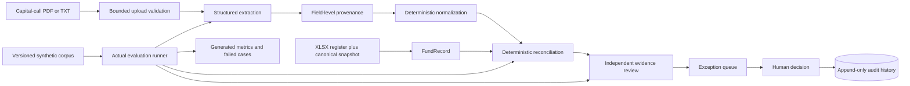

# FundOps Control Room

FundOps Control Room turns capital-call documents into evidence-backed exceptions, deterministic controls, and auditable human decisions.

This repository is a local, offline-first hackathon application for private-markets operations. It is a workflow demonstrator, not a PDF chatbot, payment system, or production-ready control platform.

## Architecture



The optional model boundary is limited to interpreting document text and independently reviewing cited evidence. Typed normalization, financial comparisons, severities, exception states, and audit writes remain deterministic. The runtime is one Streamlit process backed by SQLite; the module boundaries are documented in [docs/ARCHITECTURE.md](docs/ARCHITECTURE.md), and the canonical interfaces are in [docs/AGENT_CONTRACTS.md](docs/AGENT_CONTRACTS.md).

## Quickstart

Python 3.9 or later is supported.

```bash
python3 -m venv .venv
source .venv/bin/activate
python -m pip install --upgrade pip
python -m pip install -r requirements.txt
python -m scripts.smoke_demo
streamlit run streamlit_app.py
```

Open the local URL printed by Streamlit and choose **Load Northstar Demo**. The demo and smoke test require no API key or network access after dependencies are installed.

## Demo flow

1. Load the fictional Northstar Growth Fund II package.
2. Inspect the typed values and exact PDF evidence in the **Extraction Ledger**.
3. Show the register expectation of GBP 625,000 and incoming amount of GBP 650,000.
4. Open **Reconciliation Results** to show the deterministic GBP +25,000 amount variance and two-day due-date variance.
5. Open **Exception Queue** to inspect the separate evidence-review findings; source support never clears a reconciliation break.
6. Record **Needs investigation** with a reason, then confirm the new document-scoped event in **Audit Log**.
7. Open **Evals** to run the current code over the versioned synthetic corpus and inspect denominators, regression gates, and failed cases.

The prepared presentation path is in [DEMO.md](DEMO.md). Technically precise implementation boundaries are in [docs/JUDGE_QUESTIONS.md](docs/JUDGE_QUESTIONS.md).

## Why deterministic reconciliation is separate from LLM interpretation

Document interpretation is probabilistic: wording, layout, and terminology vary. A model can help map that material into a narrow schema, but it is not the authority for arithmetic or control outcomes.

Reconciliation is deterministic because the same typed inputs must always produce the same result. Python `Decimal` arithmetic, date calculations, explicit missing and review states, currency checks, confidence thresholds, and fixed severity rules decide whether values agree. The independent reviewer only assesses whether cited evidence supports an extracted value; it cannot rewrite extraction, clear a deterministic mismatch, or make the human decision.

When model mode is enabled, each accepted model field must identify a known field, typed value, page, confidence, and evidence text found on that page. Invalid, partial, unavailable, or ungrounded model output falls back visibly or remains reviewable. Without `OPENAI_API_KEY`, model mode fails closed to the offline deterministic path rather than crashing.

## Evaluation methodology

The evaluation command executes the current extraction, reconciliation, and reviewer code against a versioned, entirely fictional corpus:

```bash
python -m app.evals --mode fixture --fail-on-regression
```

The runner verifies fixture hashes, writes an atomic JSON result, and reports explicit numerators and denominators for normalized field extraction, correct abstention, end-to-end exception precision/recall, isolated deterministic rule correctness, case-level reviewer escalation, latency, and provider usage. Failure analysis remains visible even when the declared regression gates pass.

Fixture mode makes zero model calls and is not an LLM evaluation. Model mode tracks grounded model-origin fields separately from deterministic fallback or fill-ins, so hybrid results cannot be presented as model accuracy. The corpus is a regression fixture, not evidence of real-world accuracy, statistical generalization, or production readiness. See [docs/DATASET.md](docs/DATASET.md) for scenario-level labels.

## Optional model mode

The offline path is the default. To try the OpenAI-compatible extraction and evidence-review adapters:

```bash
export OPENAI_API_KEY="..."
export OPENAI_MODEL="gpt-4.1-mini"
# Optional compatible endpoint:
export OPENAI_BASE_URL="https://api.openai.com/v1"
streamlit run streamlit_app.py
```

Only call a run model-backed when its field provenance shows `OPENAI_COMPATIBLE` and no fallback warning applies. Optional model processing sends document text or minimized field evidence to the configured endpoint.

## Tests

```bash
python -m pytest -q
python -m app.evals --mode fixture --fail-on-regression
python -m scripts.smoke_demo
```

There is no separate JavaScript frontend in this repository; Streamlit UI contracts are covered by the Python test suite and a server health smoke test.

## Known limitations

- All funds, investors, documents, amounts, and labels are synthetic. There has been no permissioned real-document validation.
- The UI ingests text-based PDF/TXT notices. The included XLSX register is a real downloadable fixture, but the demo currently loads its checked-in canonical JSON row rather than performing live workbook ingestion.
- OCR, layout-aware candidate extraction, entity resolution, batch deduplication, remaining-commitment controls, amended-notice linking, and payment-receipt matching are not complete. The eval output keeps representative misses visible.
- The independent reviewer is field- and evidence-scoped; it cannot detect issues that require a second register row, unlabelled layout context, another document, or cross-field portfolio state unless that context is added upstream.
- SQLite is local single-process storage. The app has no SSO, RBAC, tenant isolation, immutable source archive, malware scanner, managed encryption, or production deployment controls.
- Human **Approved**, **Rejected**, and **Needs investigation** actions append audit events only. They do not update a fund administrator system or move money.
- Fixture confidence values and latency measurements are descriptive local signals, not calibrated production probabilities or service-level objectives.
