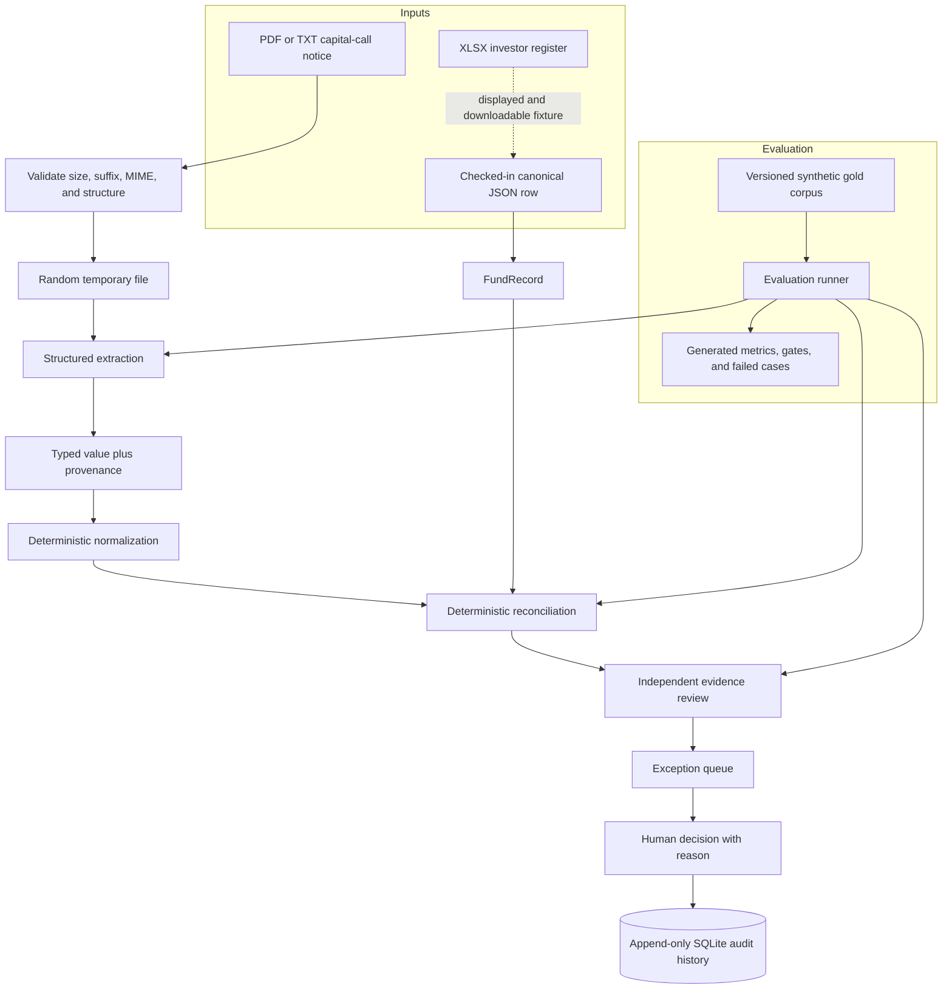

# Architecture

FundOps Control Room is an offline-first Streamlit application that demonstrates an evidence-preserving capital-call control workflow. It runs as one local Python process so the demo is dependable, while keeping domain boundaries explicit enough to extract into services later.

## Implemented flow

The XLSX file is a genuine synthetic workbook and its relevant cell addresses are displayed in the demo. The current application does not parse that workbook into the live record: it loads a checked-in JSON snapshot that matches the selected row. This boundary is intentional and visible rather than presented as a connector that does not exist.

## Canonical module ownership

| Concern | Canonical implementation | Responsibility |
| --- | --- | --- |
| Domain types | `app/models.py` | Pydantic records, extracted fields, reconciliation results, and human audit events |
| Deterministic normalization | `app/normalization.py` | Fail-closed monetary and currency normalization used by financial controls |
| Extraction | `app/extraction.py` | PDF/TXT reading, labelled deterministic extraction, and optional grounded model extraction |
| Reconciliation | `app/reconciliation.py` | Exact expected-versus-observed controls, status, severity, and difference calculation |
| Independent review | `app/review.py` | Evidence-only findings that cannot mutate or clear reconciliation |
| Audit persistence | `app/storage.py` | Append-only document-scoped SQLite events and read APIs |
| Upload safety | `app/file_handling.py` | Bounded structural validation, random staging paths, and cleanup |
| Public failures | `app/errors.py` | Allowlisted error codes, stages, safe messages, and request IDs |
| Observability | `app/observability.py` | Redacted per-stage JSON telemetry with no free-form document metadata |
| Evaluation | `app/evals/` | Gold loading, current-code execution, metrics, gates, artifacts, and UI adapter |
| Orchestration/UI | `streamlit_app.py` | Session state, workflow invocation, exception decisions, and generated eval display |

There is one implementation for each concern. Compatibility names such as `ReconciliationResult` and `reconcile_records` are aliases to the canonical implementation, not competing models or engines.

## Trust boundaries

### Input and temporary storage

Uploads are checked before parsing. The application accepts only allowlisted formats, applies a 10 MiB limit, checks signatures/package structure, writes to a random temporary location, and deletes that copy after processing. Original bytes remain only in active Streamlit session state so the user can download the source during the demo.

### Optional model extraction

The model may propose structured fields, but every accepted field must use a known name, coerce into the domain type, include a finite confidence, cite a valid page, and quote evidence present on that page. Invalid or partial model output is discarded or filled by the deterministic extractor with per-field method provenance. Provider failure produces a disclosed fallback; it does not bypass reconciliation.

### Deterministic normalization and reconciliation

Financial values are normalized with fail-closed locale and accounting rules. Ambiguous or unsupported syntax becomes a review state instead of a guessed amount. Reconciliation uses `Decimal`, exact dates, explicit missing handling, currency controls, stable severities, and zero monetary tolerance by default. No network call or model response participates in comparison arithmetic.

### Independent evidence review

The reviewer receives one allowlisted field request containing the extracted value, its citation, and that field's reconciliation snapshot. It returns a separate finding. A `SUPPORTED` citation means the source supports the extracted value; it never means the value agrees with the fund record. Reviewer failure or insufficient evidence requires human review.

### Human decision and audit

The exception UI requires a reason before recording `APPROVED`, `REJECTED`, or `NEEDS_INVESTIGATION`. The event snapshots the relevant values, variance, reviewer result, source locator, actor, UTC timestamp, and a document-scope digest. Storage exposes append and read operations only, and SQLite triggers reject update, delete, and replacement attempts. This is local append-only audit history, not a cryptographic ledger.

## Evaluation path

`python -m app.evals --mode fixture --fail-on-regression` verifies fixture hashes and runs the same extraction, reconciliation, and reviewer implementations used by the demo. The result artifact contains its dataset digest, environment metadata, explicit supports, provider telemetry, regression-gate policy, and ranked failed cases. Isolated rule correctness injects gold extracted values to distinguish reconciliation defects from upstream extraction defects.

Fixture mode is a deterministic regression baseline and makes no model calls. Model mode keeps grounded model-origin fields separate from deterministic fallback and fill-ins. Neither mode establishes production accuracy without a permissioned representative dataset and an appropriate statistical design.

## Deployment boundary

The implemented deployment is a single-user local Streamlit process with SQLite. A production system would need immutable source storage, an idempotent job queue, Postgres or another managed audit database, enterprise identity and authorization, tenant isolation, malware scanning, encryption/key management, retention controls, provider governance, monitoring, and batch/cross-document controls. Those capabilities are not represented as present in this repository.
